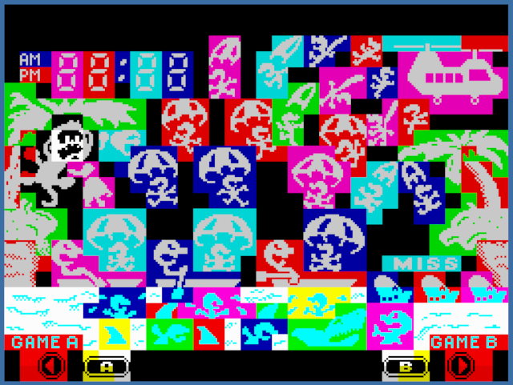

# ZX Parachute

ZX Spectrum Parachute is a conversion of the nintendo all time classic parachute gameandwatch to ZX Spectrum 16k.

This fan conversion is done non profit just for fun.

All game is attributes based so except for the clock there are not a single change in the screen.



8/6/2020 - Version 0.2

Carles Oriol - Barcelona 2020
carlesoriol@gmail.com

## Play

Open z80 or tap file in any ZX Spectrum, FPGA machine or emulator you like.

* Keys: **1 to 5** - Move **left**  (left arrow = 5)
* Keys: **6 to 0** - Move **right** (right arrow = 8)

* Key: **H** - Increments Hour
* Key: **M** - Increments Minutes

* Key: **A** - Select game A
* Key: **B** - Select game B

* Key: **C** - Restart game 
* Key: **X** - Quits game (reset)


## Compile

Assembly with Retro Virtual Machine assembler inside a ZX Spectrum 16K or 48k.

```
asm parachute.asm
```

## To Do

Implement Game B

## Thanks

* Thanks to Nintendo for this amazing game that wasted so many hours in my childhood.
* Thanks to Sinclair Computers and to Sir Clive Sinclair for creating the ZX Spectrum that gave me my hobby, my passion and my career.
* Thanks to the people of retro virtual machine for creating a so enjoyable environment to develop.
* Thanks to my Nurieta for everything else in my life.

## Contributing

Just made me know if you want to publish any changes or if you have any ideas

## License
[AGPL](https://choosealicense.com/licenses/agpl/)
